# M.EIC 2024/2025 CPM - 1st Assignment

## Team

By Group 5:

-   Henrique Gonçalves Graveto Futuro da Silva (202105647)
-   Rita Isabel Guedes Correia Leite (202105309)
-   Tiago Miguel Seixas de Azevedo (202108699)

## Index

1. [Overview](#overview)
2. [How To Use](#how-to-use)
3. [Architecture](#architecture)
4. [Data Schemas](#data-schemas)
5. [Implemented Features](#implemented-features)

    5.1. [Features on the Server](#features-on-the-server)

    5.2. [Features on the QR Code Generator App](#features-on-the-qr-code-generator-app)

    5.3. [Features on the Terminal App](#features-on-the-terminal-app)

    5.4. [Features on the User App](#features-on-the-user-app)

6. [Navigation](#navigation)
7. [Security](#security)
8. [Performed Tests](#performed-tests)

    8.1. [Tests on the Server](#tests-on-the-server)

    8.2. [Tests on the User App](#tests-on-the-user-app)

## Overview

The goal of this project was to develop four integrated systems for a smart supermarket environment.

The first system is a remote service, implemented as an HTTP REST API, hosted on the supermarket's server. This service is organized into several groups of operations, including customer registration and validation, checkout processing, transaction consultation, and voucher retrieval.

The second system is an Android application designed for customers. This app allows users to register in the system, view previous transactions, retrieve vouchers, and initiate a shopping session. During shopping, customers can add items to their virtual basket by scanning tags or QR codes on the products. When ready to check out, they can complete the purchase directly through the app, optionally applying a previously retrieved voucher for a discount.

The third system involves the supermarket checkout terminals, which also run an Android application. These terminals receive the list of products, and optionally a voucher, sent from the customer’s mobile app. This information is communicated to the server, which processes the payment and returns the result of the transaction along with the total amount charged.

The fourth system is the Generator, which is also an Android application. It includes a list of products that the user can select to obtain their QR code.

## How To Use

To begin using the system, follow the steps below in the specified order to ensure proper communication between components:

1. **Change SERVER_IP**
   Open the `Constants.kt` file (under the `utils` folder) in the `server`, `terminal` and `generator` apps, then change the variable `SERVER_IP` to the IP address of the machine where the server is hosted.

2. **Start the Server:**  
   Open a terminal window and navigate to the directory containing the `server.js` file. Once there, run `npm install` and then start the server by running the following command: `node server.js`

3. **Launch the QR Code Generator Application:**  
   After the server is up and running, install or open the application responsible for generating QR codes for the products. This step must be performed after starting the server because the QR code generator needs to inform the server of its identification key (referred to as the "supermarket key").

4. **Launch the Customer Application:**  
   Finally, install or open the customer-facing Android application. When a new user registers through the app, the server responds with two important pieces of information: the customer's UUID and the supermarket key.

**Important Note:**  
It is crucial that the supermarket key remains unchanged after a customer has registered. Since there is no implemented mechanism for the server to notify the customer of any changes to the supermarket key, altering it could lead to communication failures or inconsistencies in the system.

## Architecture

In the figure below we can see a representation of the Client Application architecture diagram.

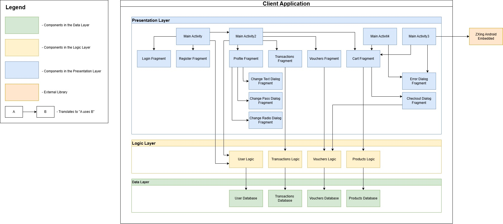

## Data Schemas

The UML diagram below represents the database schema on the server side. It consists of a total of 5 tables.

The **User** table represents the store's users, storing information such as their cryptographic keys and bank card details. The primary key is the Uuid attribute.

The **Voucher** table represents vouchers associated with users. The primary key is the pair (Uuid, UuidUser), which uniquely identifies the voucher and the user who owns it, respectively.

The **Transactions** table represents transactions made by users. The primary key is the pair (Uuid, UuidUser), which identifies the transaction and the user who performed it.

The **Nonce** table represents nonces sent to users after they request information about their vouchers or transactions. The primary key is the pair (Uuid, UuidUser), representing the value of the nonce and the recipient user.

The **Groceries** table represents the store’s products, storing information such as name, category, and price. The primary key is the Name attribute.

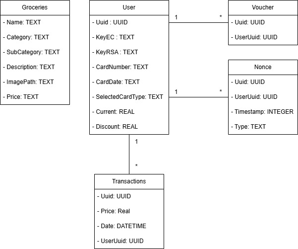

On the User Application side, there is also a local database to persistently store user information - meaning that if the user exits the application, their data is not lost. Because of this, the User Application's database has a structure identical to the one on the server side, with the exception of the Groceries and Nonce tables, which are not included.

## Implemented Features

Below is the list of implemented features, separated according to the applications where they were implemented. The applications are the Server, the QR Code Generator Application, the Payment Application (Terminal) and the Client Application.

### Features on the Server

-   Receives the public key from the supermarket, sent by the QR code generator app.
-   Registers users, providing them with their UUID and with the public key of the supermarket.
-   Makes the necessary changes to the database when receiving a payment message.

### Features on the QR Code Generator App

-   Change between light and dark mode.
-   Generates an RSA key pair.
-   Sends the public key to the server.
-   Receives products list from the server.
-   Creates QR codes for products, including their UUID, name, category, subcategory and price.
-   Filter products by name.
-   Filter products by category.
-   Order products by price.
-   Order products alphabetically.

### Features on the Terminal App

-   Change between light and dark mode.
-   Reads checkout messages via QR Code or NFC.
-   Sends the checkout request to the server.
-   Displays the server's response to the user.

### Features on the User App

- Change between light and dark mode.

-   **Authentication**

    -   Generates RSA and EC key pairs on the device.
    -   Registers the user on the server and securely stores credentials locally.
    -   Supports local login if the user is already registered. - Provides user feedback during login and registration in case of errors.

-   **Product and Cart Management**

    -   Adds products to the cart by scanning QR codes.
    -   Removes products from the cart.
    -   Sort products by selection date, name or price.
    -   Filter products by their category.
    -   Filter products by their name.
    -   Checkout configuration allows:

        -   Choosing the payment method: NFC or QR Code;
        -   Enabling or disabling discounts;
        -   Selecting a voucher (or choosing none).

-   **Payment**

    -   Generates the checkout message via QR Code or NFC.
    -   Executes the payment process.
    -   Provide the option to go back and continue shopping (payment was not completed, so the product list remains unchanged).
    -   Provide the option to confirm that the payment was completed (payment was successful, so the product list is cleared).

-   **Transactions, Vouchers and Discount**

    -   Displays recent transactions, available vouchers and discount.
    -   Requests transactions, vouchers and discount from the server using a nonce challenge for secure authentication.

-   **Data Persistence**

    -   Stores the user's product list locally in a database.
    -   Stores the user's vouchers locally in a database.
    -   Stores the user's discount locally in a database.
    -   Stores the user's transactions locally in a database.

-   **Profile**

    -   View user information obtained during registration.
    -   Make changes to user information.

## Navigation

The diagram below represents the navigation between the possible pages in the User application. It includes pages for authentication (login and registration), viewing, adding, and paying for items in the list, as well as pages for viewing recent transactions, vouchers, and discounts, and the user profile. Additionally, due to its importance, the dialog box for setting up the payment is also represented.

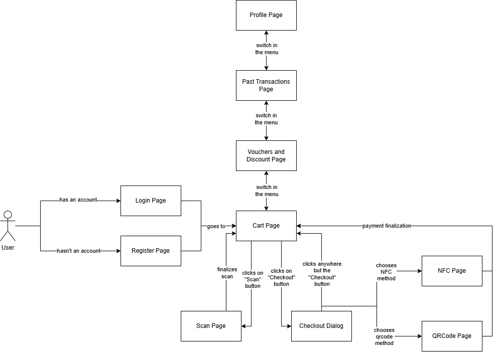

We will now present the appearance of each of these pages and dialog boxes, including those accessible through the profile page. These dialog boxes were not represented in the diagram above in order to keep it simple and easy to understand. Their purpose is solely to allow the user to update their profile information.

### Authentication

<figure>
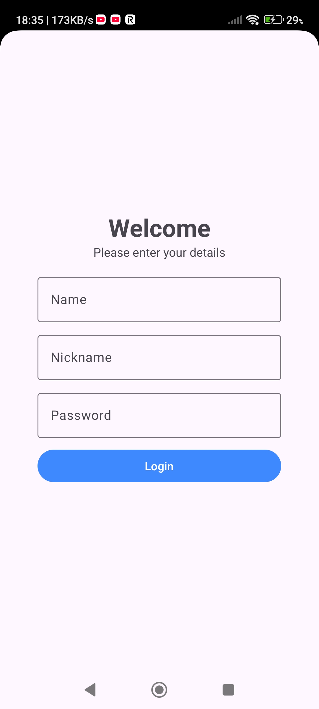
  <figcaption>Login Page</figcaption>
</figure>

<figure>
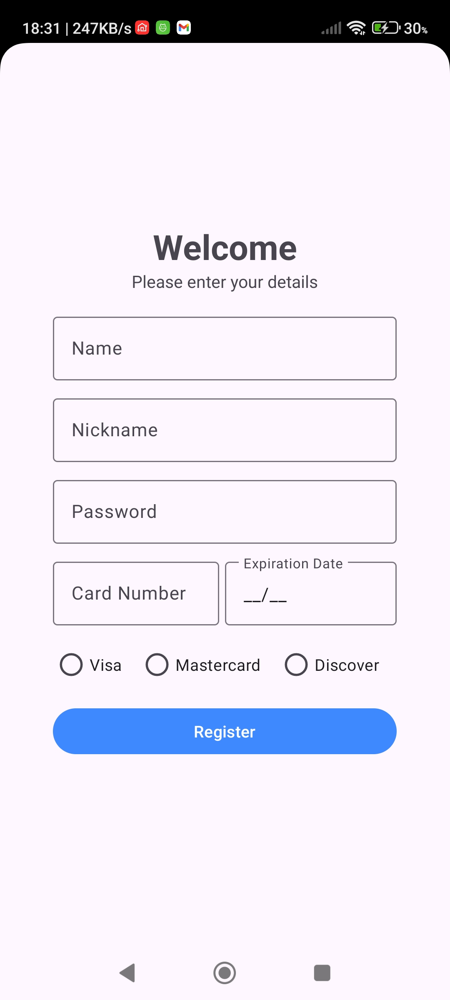
  <figcaption>Register Page</figcaption>
</figure>

### Products, Vouchers, Discount and Transactions Management

<figure>
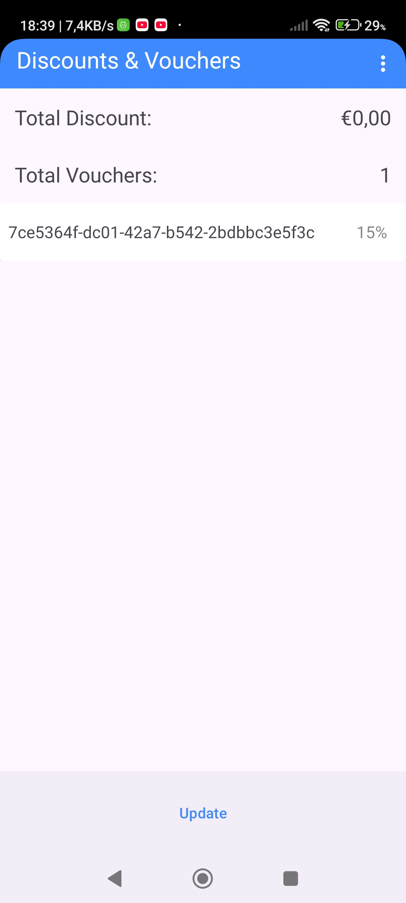
  <figcaption>Vouchers and Discount Page</figcaption>
</figure>

<figure>
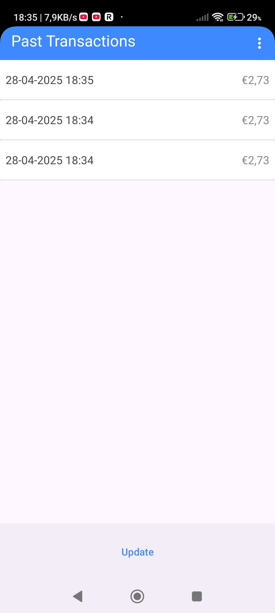
  <figcaption>Past Transactions Page</figcaption>
</figure>

<figure>
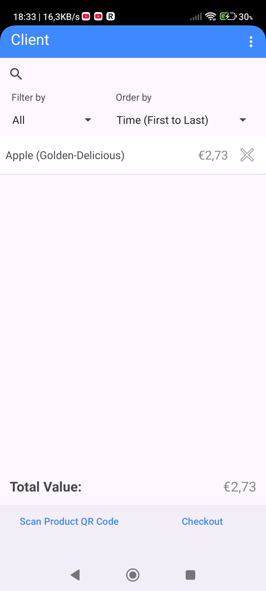
  <figcaption>Cart Page</figcaption>
</figure>

### Payment

<figure>
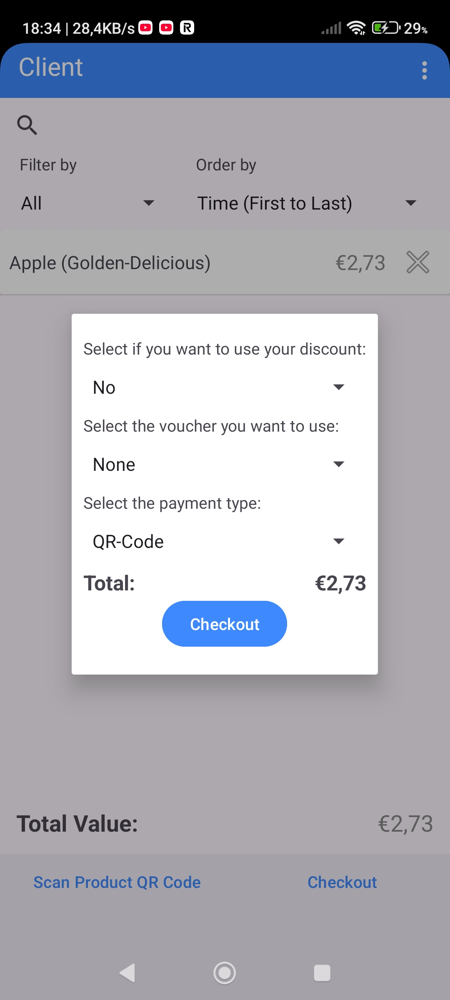
  <figcaption>Checkout Dialog</figcaption>
</figure>

<figure>
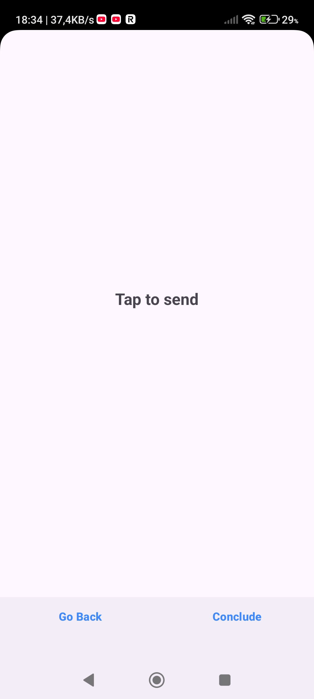
  <figcaption>NFC Page</figcaption>
</figure>

<figure>
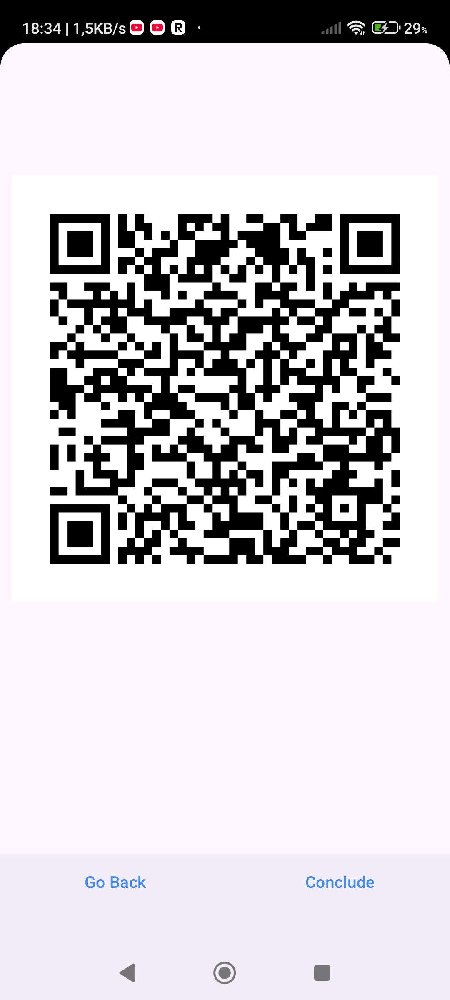
  <figcaption>QRCode Page</figcaption>
</figure>

### Profile

<figure>
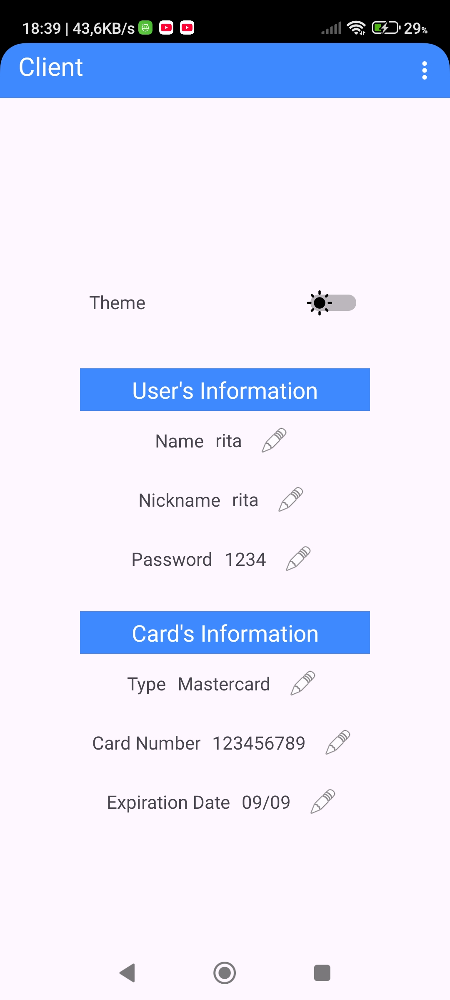
  <figcaption>Profile Page</figcaption>
</figure>

<figure>
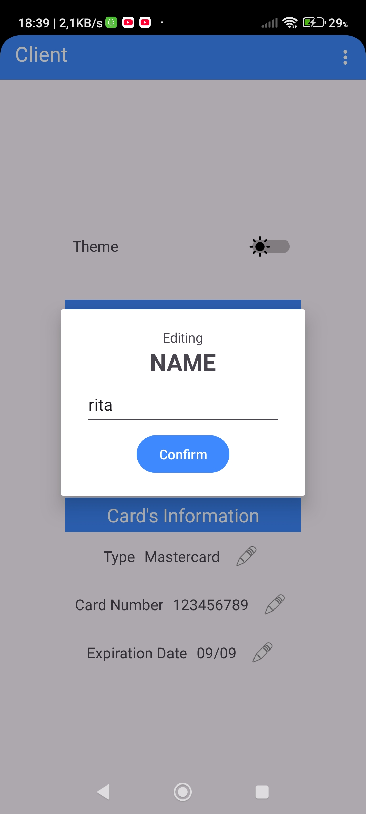
  <figcaption>Profile's Modification Page (String)</figcaption>
</figure>

<figure>
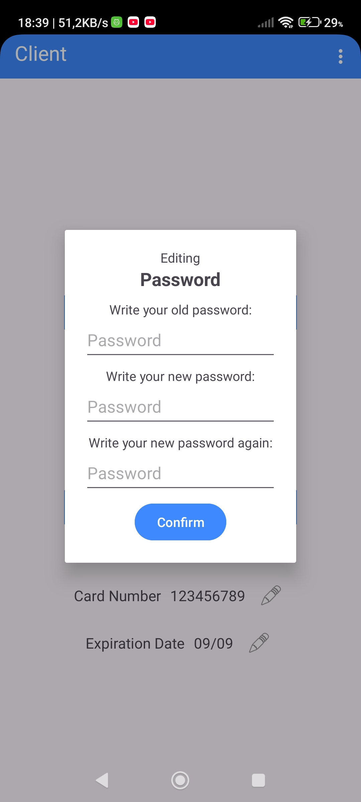
  <figcaption>Profile's Modification Page (Password)</figcaption>
</figure>

<figure>
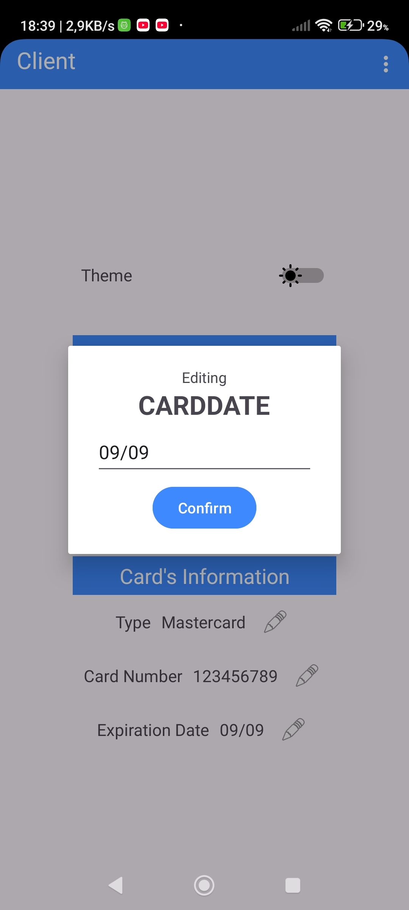
  <figcaption>Profile's Modification Page (Date)</figcaption>
</figure>

<figure>
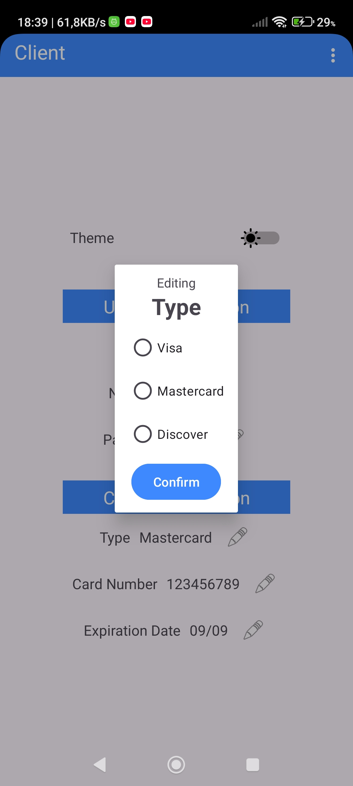
  <figcaption>Profile's Modification Page (Type)</figcaption>
</figure>

## Security

The Generator application is the first component to be initialized. Its primary task is to ensure the existence of an RSA key pair. If no such pair is found, it generates one with the following properties: a key size of `512` bits, using the `RSA` algorithm, with `SHA256WithRSA` as the signature algorithm, and `RSA/NONE/PKCS1Padding` as the encryption algorithm. This key pair is securely stored in the Android keystore under a designated alias. The public key from this pair is then sent to the server, where it is stored for future interactions with the client.

If the user has already registered, authentication is performed locally by verifying the user's name, nickname, and password, which were previously saved in the local database. If the user has not yet created an account, they are required to fill in additional registration fields. Upon attempting registration, the application generates two new key pairs: one RSA and one EC (Elliptic Curve). Both key pairs are securely stored in the Android keystore under specific aliases.

The RSA key pair generated during registration retains the same characteristics as the supermarket key: a key size of `512` bits, using `RSA` as the algorithm, `SHA256WithRSA` as the signature algorithm, and `RSA/NONE/PKCS1Padding` for encryption. The EC key pair is generated using the `EC` algorithm, specifically with the `secp256r1` curve, and uses `SHA256withECDSA` as the signature algorithm.

## Performed Tests

### Tests on the Server

-   The payment message is composed of the purchase information message and the client’s digital signature of that same message. On the server side, we altered the original message to test whether the signature verification would fail. The test was successful.

### Tests on the User App

-   We tested whether the application would crash if the server was down by attempting to use as many features as possible, expecting instead to receive a small error message indicating the server’s unavailability. The test passed.

-   We tested whether the client application handled having the wrong supermarket key gracefully. Specifically, after scanning the QR code, it did not crash but simply returned to the shopping list without making any changes to it. The test passed.

-   We tested whether the application correctly handled invalid dates for the credit card expiration field, expecting an error message to indicate the invalidity. The test passed.
