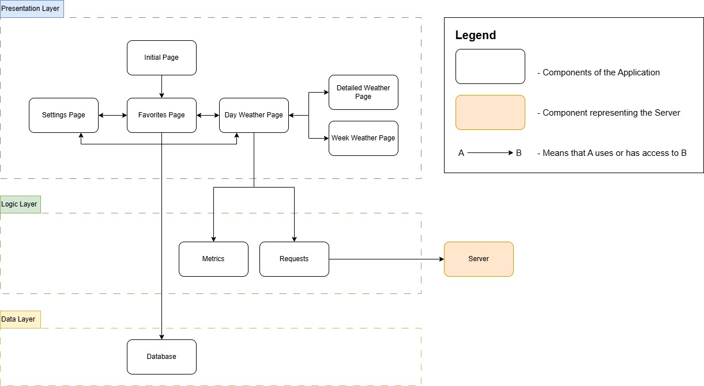
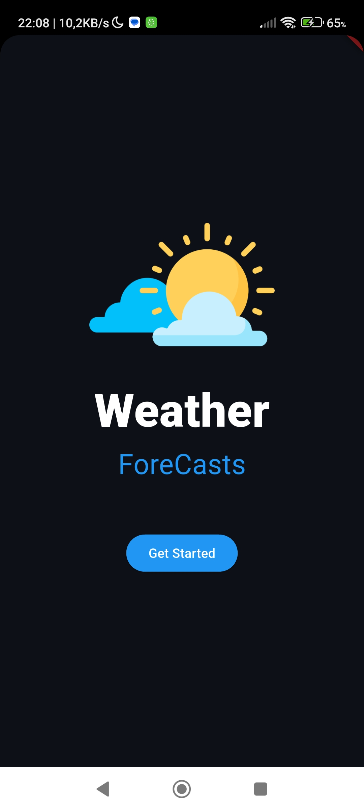
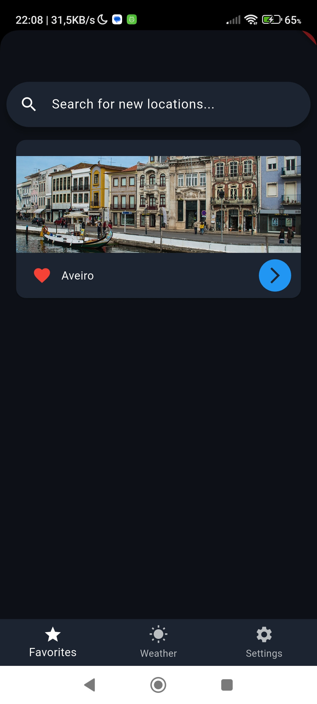
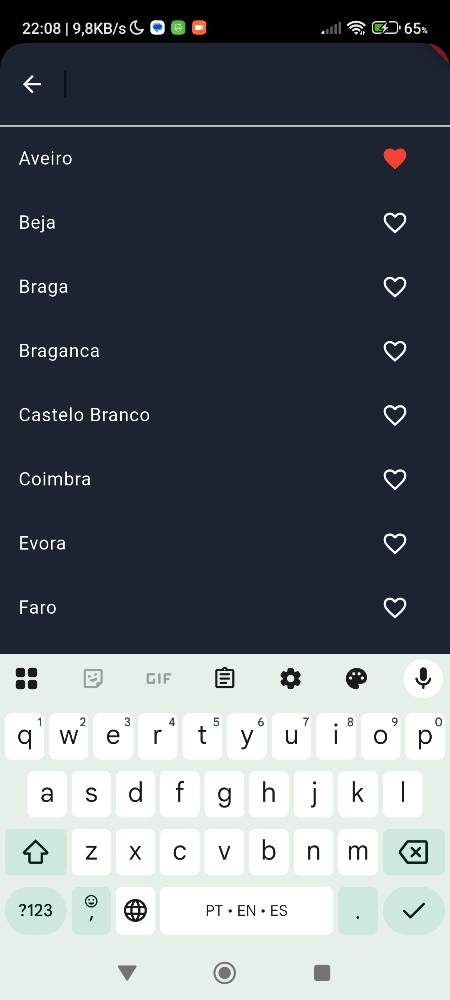
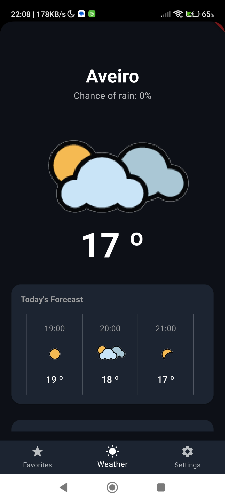
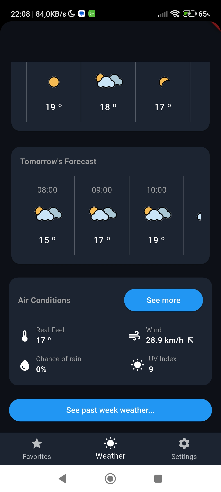
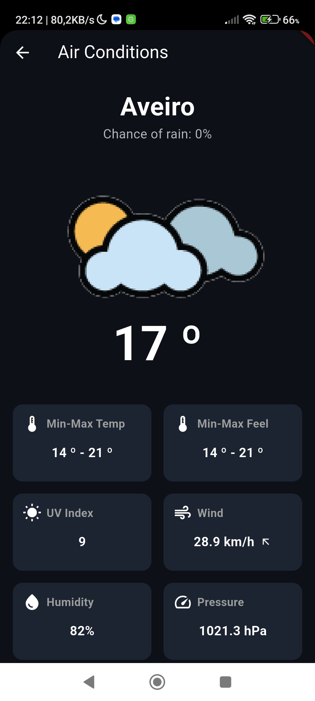
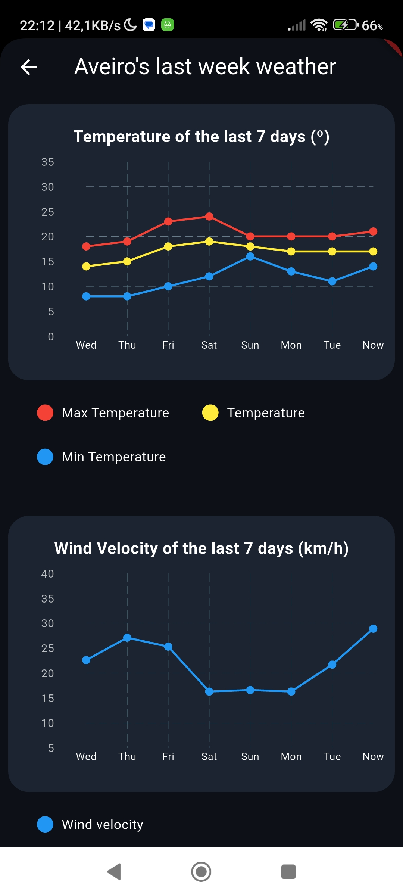
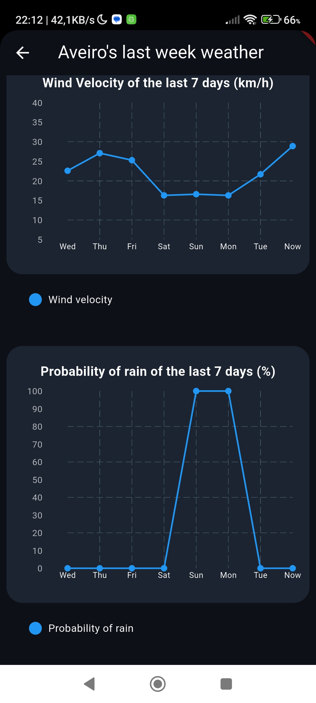
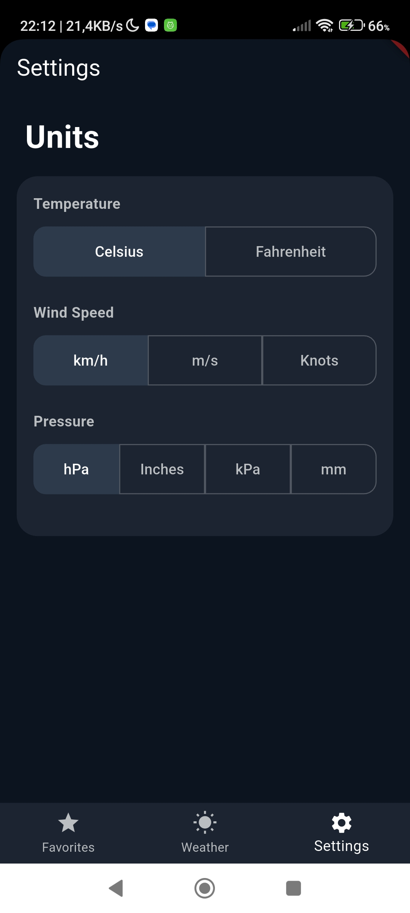

# M.EIC 2024/2025 CPM - 2st Assignment

## Team

By Group 5:

-   Henrique Gonçalves Graveto Futuro da Silva (202105647)
-   Rita Isabel Guedes Correia Leite (202105309)
-   Tiago Miguel Seixas de Azevedo (202108699)

## Index

1. [Overview](#1-overview)
2. [Features](#2-features)
3. [Architecture](#3-architecture)
4. [Interface](#4-interface)
5. [Testing](#5-testing)
5. [Bibliography](#6-bibliography)

## 1. Overview

In this project, we created two systems: a server and a client application. The application is a weather app that allows users to view the weather forecast for any district capital in Portugal. Users can also add cities to a list of favorites for quicker access. The server is responsible for handling requests from the application by using an external API where the weather data is available.

To test the application, simply follow these steps:

-   In the server folder, run the following commands in the terminal:
    ```bash
    npm install
    node server.js
    ```
-   Then, in the app folder, run:
    ```bash
    flutter run
    ```

It is important to note that before running the application, you need to define a `.env`, which must be inserted inside the `app/` folder.
You must define a variable `IP`, which will correspond to the IP of the machine where you will run the backend.

## 2. Features

**City and Favorites Management**

-   Search for any district capital in Portugal;
-   Mark cities as favorites;
-   View the list of favorite cities;
-   Persistently store the favorites list locally.

**Weather Forecast**

-   View the weather for the current day;
-   Possible to see weather conditions for the current day;
-   View the weather forecast for the next day.

**Weekly Weather Overview (Charts)**

-   Temperature chart: average, maximum, and minimum temperatures over the week;
-   Wind speed chart: wind speed trends throughout the week;
-   Rain probability chart: likelihood of precipitation over the week.

**Settings**
-   Possible to change the units in which the weather conditions are displayed;
-   These changes are stored locally in the device.

## 3. Architecture



## 4. Interface

**Initial Page**

<p>
  
</p>

**Favorites Page**

<p>
  
  
</p>

**Day Weather Page**

<p>
  
  
</p>

**Details Weather Page**

<p>
  
</p>

**Week Weather Page**

<p>
  
  
</p>

**Settings Page**

<p>
  
</p>

## 5. Testing

## 6. Bibliography

To develop this project we used the following resources:

- Mockup followed to design the interface, https://app.uizard.io/templates/LWx3MdogOJspY56ZdBV8/overview
- Pluggin sqflite, https://pub.dev/packages/sqflite;
- Pluggin fl_chart, https://pub.dev/packages/fl_chart
