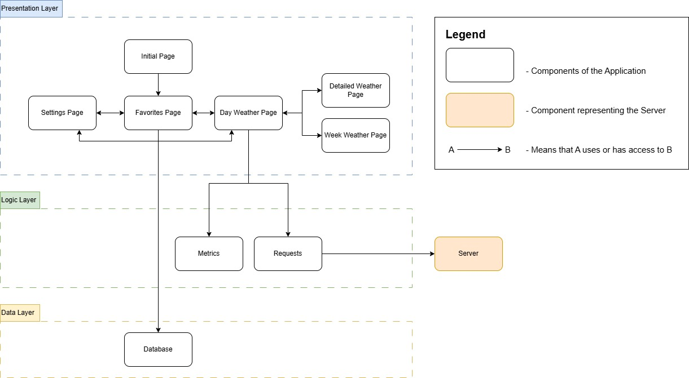
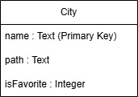
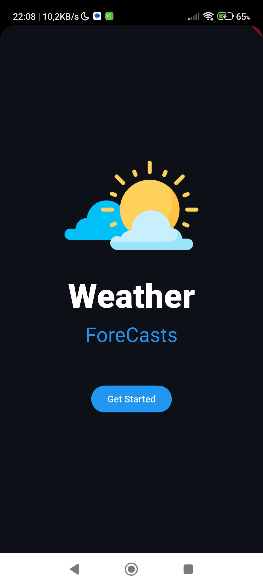
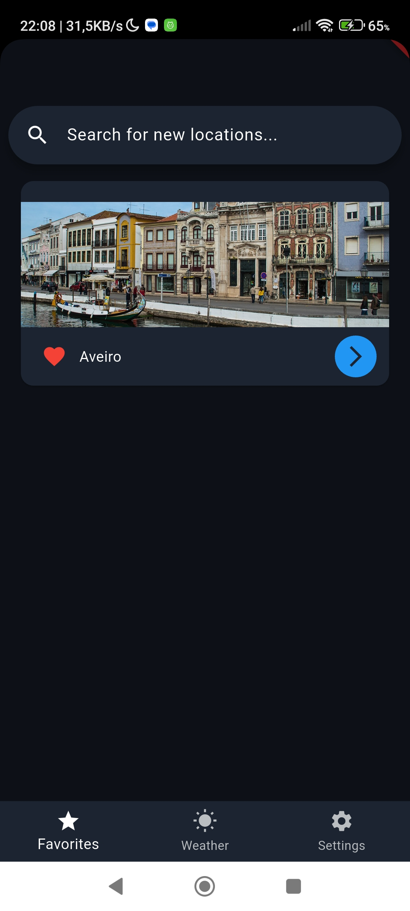
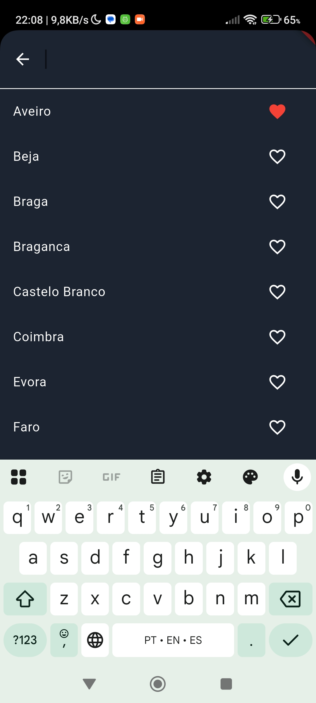
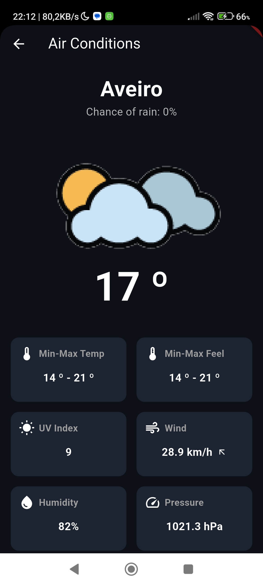
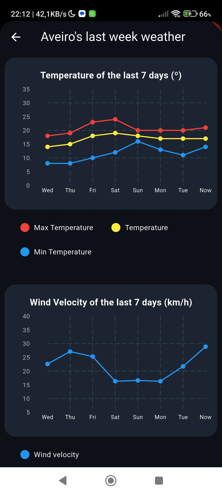

# M.EIC 2024/2025 CPM - 2st Assignment

## Team

By Group 5:

-   Henrique Gonçalves Graveto Futuro da Silva (202105647)
-   Rita Isabel Guedes Correia Leite (202105309)
-   Tiago Miguel Seixas de Azevedo (202108699)

## Index

1. [Overview](#1-overview)
2. [Features](#2-features)
3. [Libraries](#3-libraries)
4. [Architecture](#4-architecture)
5. [Data](#5-data)
6. [Interface](#6-interface)
7. [Testing](#7-testing)
8. [Bibliography](#8-bibliography)

## 1. Overview

In this project, we created two systems: a server and a client application. The application is a weather app that allows users to view the weather forecast for any district capital in Portugal. Users can also add cities to a list of favorites for quicker access. The server is responsible for handling requests from the application by using an external API where the weather data is available.

To test the application, simply follow these steps:

-   In the server folder, run the following commands in the terminal:
    ```bash
    npm install
    node server.js
    ```
-   Then, in the app folder, run:
    ```bash
    flutter run
    ```

It is important to note that before running the application, you need to define a `.env`, which must be inserted inside the `app/` folder.
You must define a variable `IP`, which will correspond to the IP of the machine where you will run the backend.

## 2. Features

**City and Favorites Management**

-   Search for any district capital in Portugal;
-   Mark cities as favorites;
-   View the list of favorite cities;
-   Persistently store the favorites list locally.

**Weather Forecast**

-   View the weather for the current day;
-   Possible to see weather conditions for the current day;
-   View the weather forecast for the next day.

**Weekly Weather Overview (Charts)**

-   Temperature chart: average, maximum, and minimum temperatures over the week;
-   Wind speed chart: wind speed trends throughout the week;
-   Rain probability chart: likelihood of precipitation over the week.

**Settings**

-   Possible to change the units in which the weather conditions are displayed;
-   These changes are stored locally in the device.

## 3. Libraries

We emphasize two main external libraries used in our application: sqflite and fl_chart.

The sqflite library is used for managing persistent data related to the user's list of favorite cities. Using this library, we created a table named cidade with the following fields:

-   `name`: the name of the city
-   `path`: the file path to the image displayed on the city's card
-   `isFavorite`: a boolean value indicating whether the city is marked as a favorite

The fl_chart library was used to create dynamic and visually engaging charts that display trends in temperature, rainfall, and wind over time.

References to the official documentation for both libraries are provided in the bibliography section of this report.

## 4. Architecture



## 5. Data

For data management, we use two different approaches.

To persistently store the list of favorite cities, we use the sqflite plugin, creating a table with the following attributes:

-   `name`: the name of the city
-   `path`: the path to the image displayed on the city's card
-   `isFavorite`: a boolean represented as 1 if the city is a favorite, or 0 if it is not



To store the user's preferred units of measurement (which are configured on the Settings page), we use SharedPreferences. This allows us to save simple key-value pairs, such as temperature.

## 6. Interface

The application starts with a landing page that contains a single "Get Started" button. When the user clicks this button, they are taken to the favorites city list page.

**Initial Page**

<p>
  
</p>

On the favorites list page, each favorite city is displayed as a card. Each card includes:

-   A heart icon that allows the user to remove the city from their favorites.
-   An arrow icon that the user can click to view more details about the city.

At the top of this page, there is also a search bar that allows users to search for specific cities in order to add or remove them from their favorites.

**Favorites Page**

<p>
  
  
</p>

When the user clicks the arrow icon on a city card, they are taken to the weather details page for that city. This page displays information such as:

-   The current temperature
-   The forecast for the next day

Additionally, this page has two buttons:

-   One that navigates to a page with more detailed information about the current day
-   Another that opens a page showing the evolution of temperature, wind, and rainfall over the past week

**Day Weather Page**

<p>
  
  
</p>

**Details Weather Page**

<p>
  
</p>

**Week Weather Page**

<p>
  
  
</p>

Finally, the app also includes a Settings page, where users can choose their preferred units of measurement, such as Celsius or Fahrenheit for temperature.

**Settings Page**

<p>
  
</p>

To better demonstrate how navigation between pages works, in the image below you can see how it actually happens.


## 7. Testing

Several tests were conducted to ensure that the application functions as expected. In addition, we made sure that, in the event of an error, the application would not crash, but instead handle the situation gracefully by displaying an appropriate error message.

For example, if the server is unreachable and the user attempts to access the weather page for a specific city, the application will simply display a message indicating that it was not possible to retrieve the necessary information.

## 8. Bibliography

To develop this project we used the following resources:

-   Mockup followed to design the interface, https://app.uizard.io/templates/LWx3MdogOJspY56ZdBV8/overview
-   Pluggin sqflite, https://pub.dev/packages/sqflite;
-   Pluggin fl_chart, https://pub.dev/packages/fl_chart
